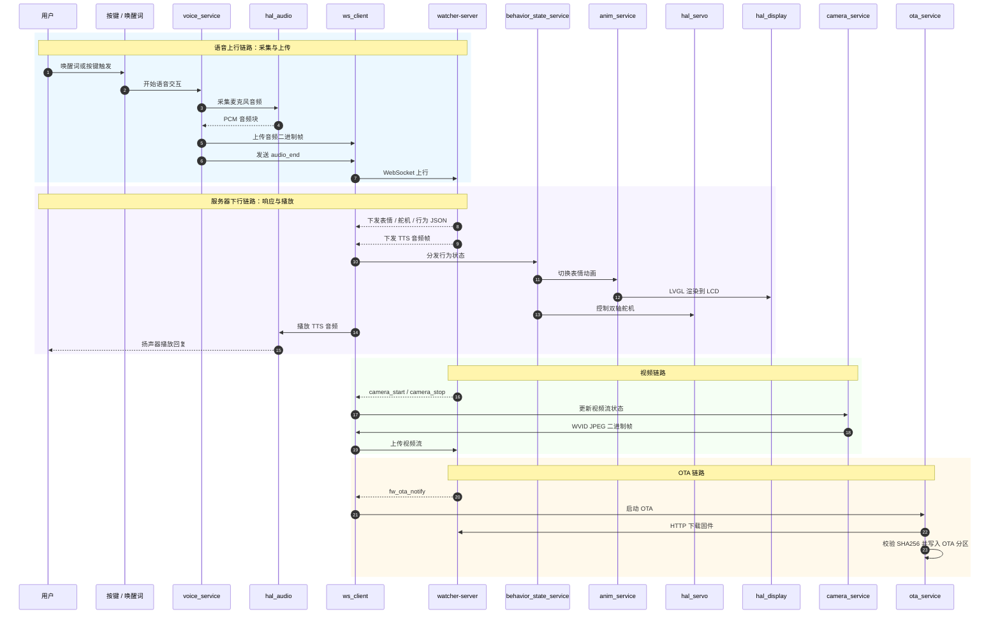
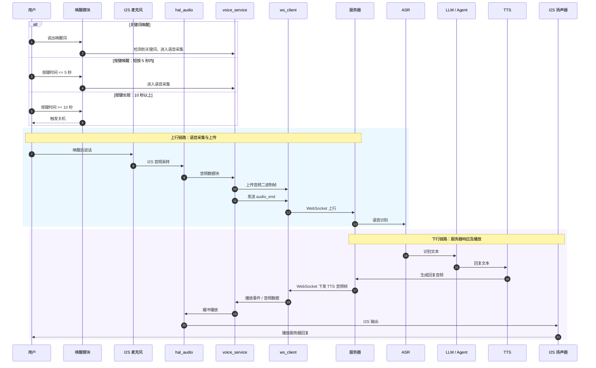
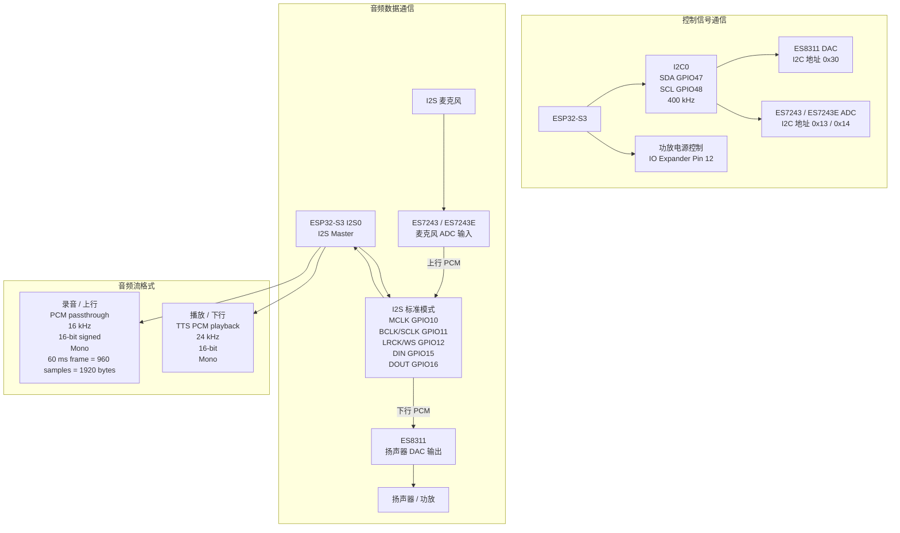
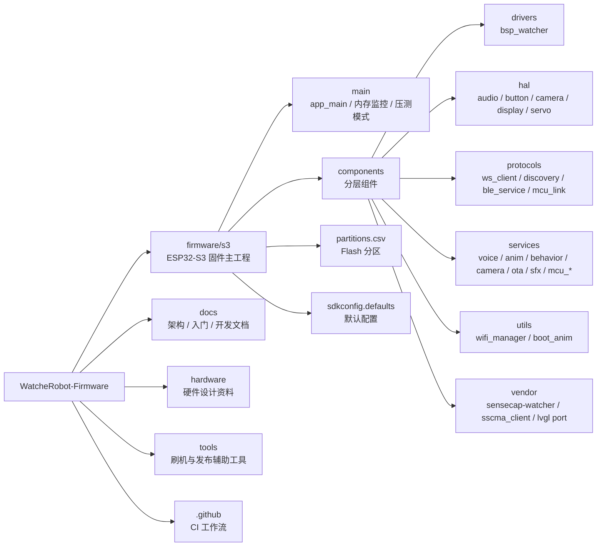

# WatcheRobot 项目架构图

本文档根据 `firmware/s3` 当前工程结构生成，展示 ESP32-S3 固件的分层组件、外部服务、硬件外设和主要数据链路。

## 总体分层架构

```mermaid
flowchart TB
    subgraph Cloud["云端 / 局域网服务"]
        Server["watcher-server<br/>Python WebSocket 服务"]
        ASR["ASR<br/>语音识别"]
        Agent["LLM / Agent<br/>意图处理"]
        TTS["TTS<br/>语音合成"]
        FwServer["HTTP 固件 / 资源服务器"]
        Server --> ASR --> Agent --> TTS --> Server
    end

    subgraph Device["ESP32-S3 固件 firmware/s3"]
        Main["main/app_main.c<br/>系统启动 / 组件初始化 / 任务编排"]

        subgraph Services["Layer 4: services 业务服务层"]
            Voice["voice_service<br/>唤醒 / 录音 / TTS 播放生命周期"]
            Anim["anim_service<br/>表情动画 / LVGL 播放"]
            Behavior["behavior_state_service<br/>行为状态管理"]
            Control["control_ingress<br/>控制入口聚合"]
            CameraSvc["camera_service<br/>视频流控制"]
            OTA["ota_service<br/>固件 OTA"]
            SFX["sfx_service<br/>本地音效播放"]
            McuMotion["mcu_motion_service<br/>运动控制"]
            McuLed["mcu_led_service<br/>灯效控制"]
            McuSensor["mcu_sensor_service<br/>传感器读取"]
        end

        subgraph Protocols["Layer 3: protocols 通信协议层"]
            WS["ws_client<br/>WebSocket JSON / 二进制音视频"]
            Discovery["discovery<br/>UDP 服务发现"]
            BLE["ble_service<br/>BLE 控制 / WiFi 配网"]
            McuLink["mcu_link<br/>UART 帧协议 / CRC / COBS"]
        end

        subgraph HAL["Layer 2: hal 硬件抽象层"]
            Audio["hal_audio<br/>I2S 麦克风 / 扬声器 / PCM"]
            Button["hal_button<br/>按键输入"]
            Display["hal_display<br/>QSPI LCD / LVGL Port"]
            Servo["hal_servo<br/>GPIO 19/20 LEDC PWM 舵机"]
            CameraHal["hal_camera<br/>Himax 图像帧接口"]
        end

        subgraph Drivers["Layer 1: drivers / vendor 底层驱动与第三方组件"]
            BSP["bsp_watcher<br/>板级封装"]
            SenseCAP["sensecap-watcher SDK"]
            SSCMA["sscma_client"]
            LvglPort["esp_lvgl_port"]
            IOExpander["esp_io_expander_pca95xx_16bit"]
        end

        subgraph Utils["utils 工具层"]
            WiFi["wifi_manager<br/>WiFi 连接管理"]
            BootAnim["boot_anim<br/>启动动画"]
        end

        Main --> Voice
        Main --> Anim
        Main --> Behavior
        Main --> Control
        Main --> CameraSvc
        Main --> OTA
        Main --> SFX
        Main --> WS
        Main --> Discovery
        Main --> BLE
        Main --> WiFi
        Main --> BootAnim

        Voice --> Audio
        Voice --> Button
        Voice --> WS
        SFX --> Audio
        Anim --> Display
        Behavior --> Anim
        Behavior --> Servo
        Control --> Behavior
        Control --> Servo
        CameraSvc --> CameraHal
        CameraSvc --> WS
        OTA --> FwServer

        WS --> Control
        WS --> CameraSvc
        WS --> OTA
        Discovery --> WiFi
        BLE --> WiFi
        BLE --> Control
        BLE --> Servo
        McuMotion --> McuLink
        McuLed --> McuLink
        McuSensor --> McuLink

        Audio --> SenseCAP
        Button --> SenseCAP
        Display --> SenseCAP
        Display --> LvglPort
        Servo --> McuMotion
        CameraHal --> SenseCAP
        CameraHal --> SSCMA
        BSP --> SenseCAP
        SenseCAP --> LvglPort
        SenseCAP --> IOExpander
        SenseCAP --> SSCMA
    end

    subgraph Hardware["硬件外设"]
        Mic["I2S 麦克风"]
        Speaker["I2S 扬声器"]
        LCD["SPD2010<br/>412x412 QSPI LCD"]
        Servos["双轴舵机<br/>GPIO 19 / GPIO 20"]
        Himax["Himax HX6538 摄像头"]
        ExtMCU["可选 MCU 外设<br/>运动 / LED / 传感器"]
        Flash["16MB Flash<br/>OTA 分区 / SPIFFS"]
        PSRAM["8MB PSRAM<br/>LVGL / 动画缓存"]
        SD["SD 卡<br/>动画资源"]
    end

    WS <-->|"WiFi WebSocket<br/>JSON 控制 + 音频 + WVID 视频"| Server
    Discovery <-->|"UDP 服务发现"| Server
    BLE <-->|"BLE GATT / WiFi Provisioning"| Phone["手机 / BLE 客户端"]
    OTA -->|"HTTP 下载"| FwServer

    Audio <--> Mic
    Audio <--> Speaker
    Display --> LCD
    Servo --> Servos
    CameraHal <--> Himax
    McuLink <--> ExtMCU
    OTA --> Flash
    Anim --> PSRAM
    Anim --> SD
```

## 核心业务链路

## 音频链路层

```mermaid
flowchart LR
    subgraph Wakeup["唤醒方式"]
        UserAction["用户触发"]
        KeywordWake["关键词唤醒<br/>检测到唤醒词"]
        ButtonWake["按键唤醒"]
        ShortPress["短按<br/>5 秒内"]
        LongPress["长按<br/>10 秒以上"]
        StartVoice["进入语音采集"]
        PowerOff["触发关机"]

        UserAction --> KeywordWake
        UserAction --> ButtonWake
        KeywordWake --> StartVoice
        ButtonWake --> ShortPress
        ButtonWake --> LongPress
        ShortPress --> StartVoice
        LongPress --> PowerOff
    end

    subgraph Uplink["上行链路：语音采集与上传"]
        UserVoice["用户语音"]
        MicIn["I2S 麦克风"]
        HalAudioRx["hal_audio<br/>音频采集 / 采样率处理"]
        VoiceCapture["voice_service<br/>录音 / 分片"]
        WsUplink["ws_client<br/>音频二进制帧 + audio_end"]
        WiFiUp["WiFi"]
        ServerRx["服务器<br/>接收音频"]
        ASR["ASR<br/>语音识别"]

        UserVoice --> MicIn
        MicIn --> HalAudioRx
        HalAudioRx --> VoiceCapture
        VoiceCapture --> WsUplink
        WsUplink --> WiFiUp
        WiFiUp --> ServerRx
        ServerRx --> ASR
    end

    subgraph Downlink["下行链路：服务器响应及播放"]
        Agent2["LLM / Agent<br/>生成回复"]
        TTS2["TTS<br/>回复音频生成"]
        ServerTx["服务器<br/>下发音频流"]
        WiFiDown["WiFi"]
        WsDownlink["ws_client<br/>接收 TTS 音频帧"]
        Playback["voice_service / audio worker<br/>缓冲播放控制"]
        HalAudioTx["hal_audio<br/>解码 / 扬声器输出"]
        SpeakerOut["I2S 扬声器"]
        UserHear["用户听到回复"]

        Agent2 --> TTS2
        TTS2 --> ServerTx
        ServerTx --> WiFiDown
        WiFiDown --> WsDownlink
        WsDownlink --> Playback
        Playback --> HalAudioTx
        HalAudioTx --> SpeakerOut
        SpeakerOut --> UserHear
    end

    StartVoice --> VoiceCapture
    ASR --> Agent2
```

## 音频编解码器与音频流格式

| 项目 | 当前工程配置 |
|------|--------------|
| 麦克风输入编解码器 | `ES7243` ADC；若未检测到 `0x13`，回退使用 `ES7243E`，地址 `0x14` |
| 扬声器输出编解码器 | `ES8311` DAC，地址 `0x30` |
| 控制信号通信 | I2C0，SDA `GPIO47`，SCL `GPIO48`，400 kHz |
| 音频数据通信 | I2S0，ESP32-S3 为 Master |
| I2S 管脚 | MCLK `GPIO10`，BCLK/SCLK `GPIO11`，LRCK/WS `GPIO12`，DIN `GPIO15`，DOUT `GPIO16` |
| I2S 数据格式 | Standard I2S，mono，16-bit，MSB first，little-endian |
| 上行音频流 | PCM passthrough，无压缩；16 kHz，16-bit signed，mono |
| 上行帧大小 | 60 ms，960 samples，1920 bytes，约 256 kbps |
| 下行音频流 | TTS PCM playback；24 kHz，16-bit，mono |
| 功放控制 | codec PA power 通过 IO expander pin 12 控制 |

## 工程目录视图

## 说明

- 项目目标架构为四层组件模型：`services` -> `protocols` / `hal` / `utils` -> `drivers` / ESP-IDF。
- 图中保留了当前工程里的实际组件，例如 `behavior_state_service`、`control_ingress`、`mcu_link`、`sfx_service` 等。
- 当前工程存在少量过渡期依赖，例如 `hal_servo` 私有依赖 `mcu_motion_service`、部分协议组件直接路由到服务组件；图中按当前 CMake 依赖关系如实体现。
- 本文档只生成架构图，不涉及 `idf.py build`。
